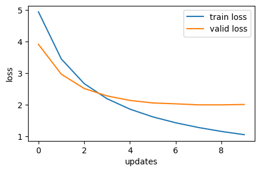
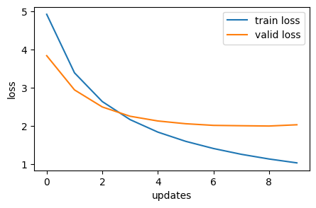
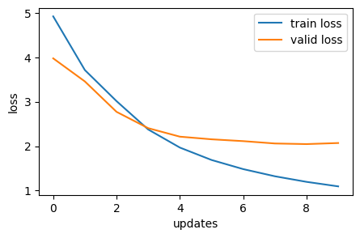
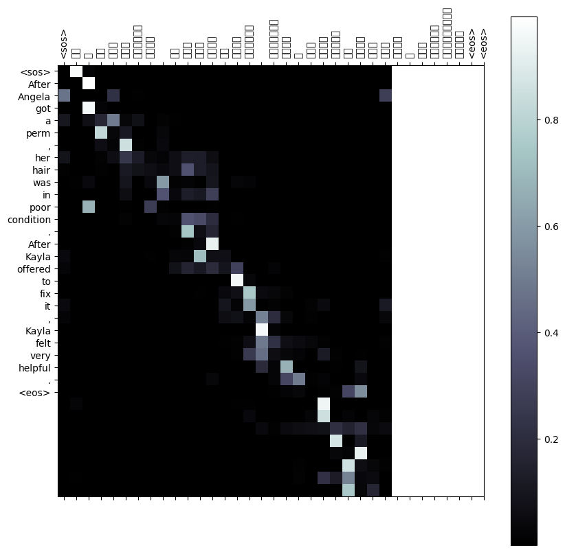
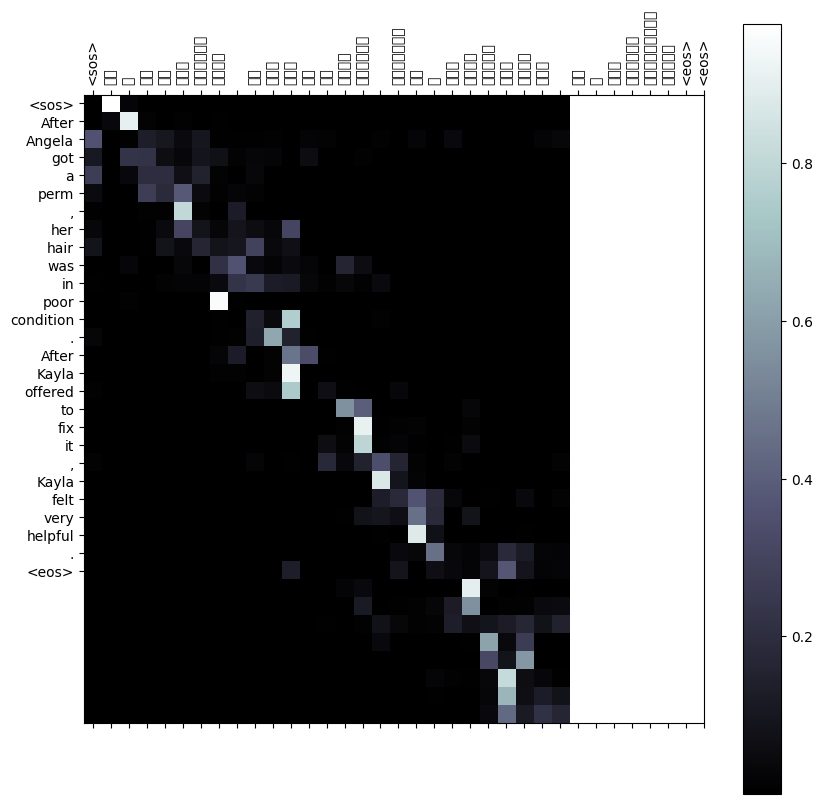
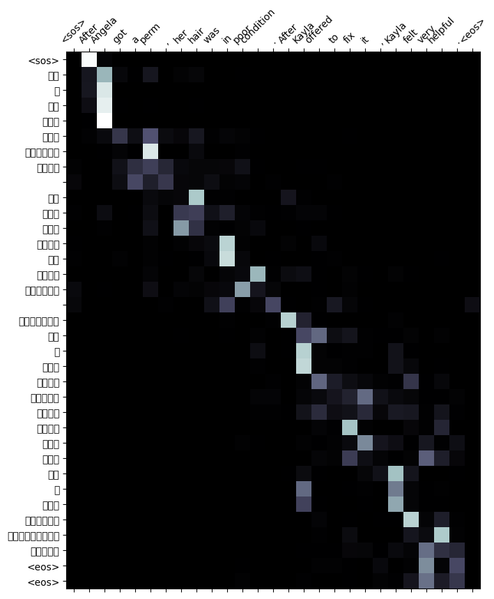
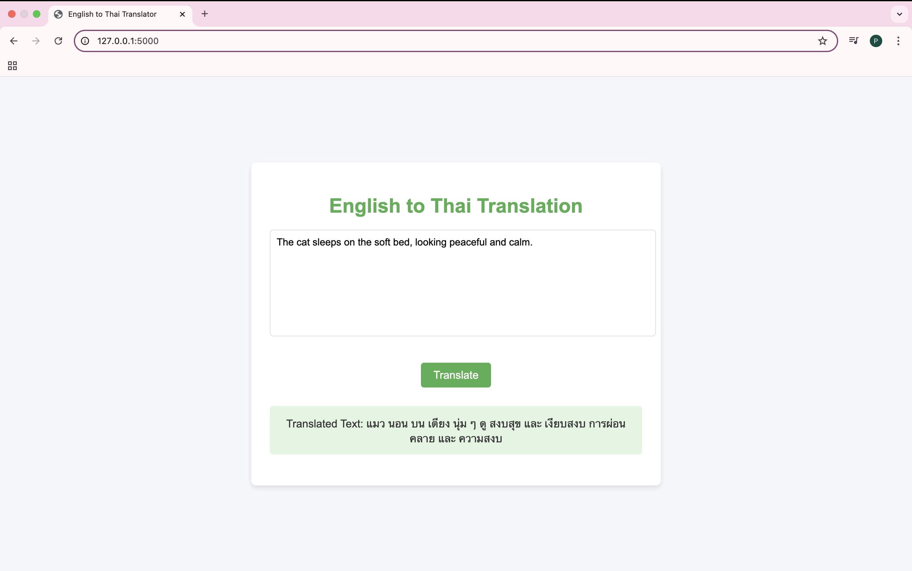
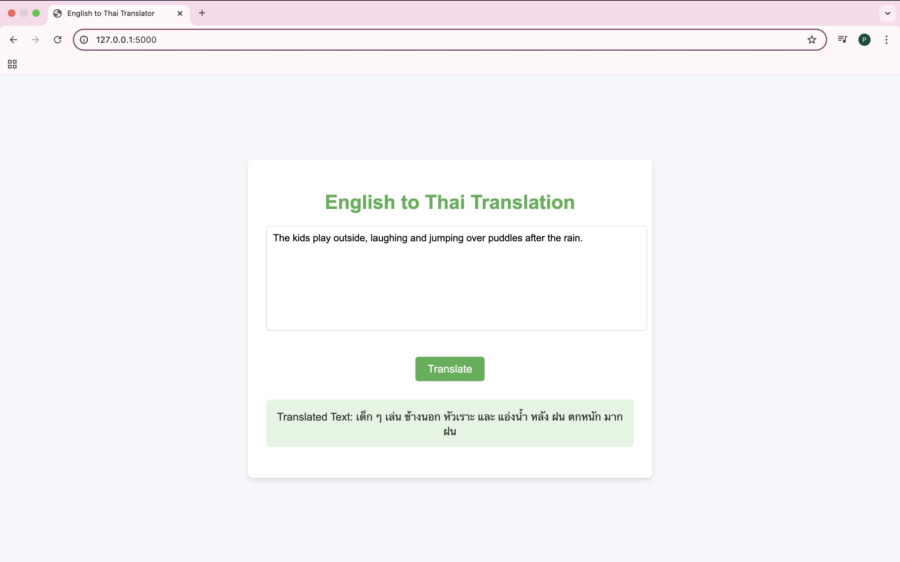

# Neural Machine Translation with Attention: English to Thai Translation

This project explores the use of neural machine translation (NMT) to translate between English and Thai using three different attention mechanisms: General Attention, Multiplicative Attention, and Additive Attention. The goal is to evaluate the effectiveness of these attention mechanisms in translating between the two languages.

## Project Overview
This repository implements neural machine translation models that incorporate three attention mechanisms to translate between English and Thai. The models are evaluated using various metrics, and performance is compared through training / validation loss plots and attention maps.

### Attention Mechanisms Implemented:

**1. General Attention:** A simple attention mechanism where the attention score is computed using a dot product between the query vector $𝑠$ and the key vector $ℎ𝑖$.

$$
e_i = s^T h_i \in \mathbb{R} \quad \text{where} \quad d_1 = d_2
$$

**2. Multiplicative Attention:** An enhanced attention mechanism where the query is transformed using a learned weight matrix $𝑊$, and the attention score is computed as the dot product between the transformed query and key.

$$
e_i = s^T W h_i \in \mathbb{R} \quad \text{where} \quad W \in \mathbb{R}^{d_2 \times d_1}
$$

**3. Additive Attention:** A more complex attention mechanism that applies a non-linearity (tanh) to a linear combination of the query and key before computing the attention score.

$$
e_i = v^T \tanh(W_1 h_i + W_2 s) \in \mathbb{R}
$$

## Language Pair and Dataset Preparation

### 1. Dataset Selection

The dataset used for training the model is the **english_thai_texts** from Hugging Face, titled *kvush/english_thai_texts*. This dataset consists of 59,859 text samples, containing pairs of English and Thai sentences. It is designed for training models in the task of neural machine translation, enabling the translation of text between English and Thai. The dataset is particularly useful for developing language models focused on cross-lingual understanding and translation between these two languages.

**Dataset Source:** Hugging Face Datasets, *kvush/english_thai_texts*

**Available at:** [Hugging Face - kvush/english_thai_texts](https://huggingface.co/datasets/kvush/english_thai_texts)

### 2. Dataset Preprocessing
The preprocessing steps for the English-Thai dataset are as follows:

**Tokenization:** Tokenization is performed on both English and Thai sentences using the following methods:

- **English:** The English text is tokenized using the `spaCy` tokenizer (`en_core_web_sm`).
- **Thai:** The Thai text is tokenized using `PyThaiNLP`, a popular Thai language processing library, for word segmentation.

The tokenization process is done using the `get_tokenizer` function from `torchtext` for English and `word_tokenize` from **PyThaiNLP** for Thai.`
- **For English:** `get_tokenizer('spacy', language='en_core_web_sm')`
- **For Thai:** `pythainlp.word_tokenize()`

**Numericalization:** After tokenization, we build vocabularies for both the source (English) and target (Thai) languages. The vocabularies are constructed using **torchtext**'s `build_vocab_from_iterator`. Special tokens like `<unk>`, `<pad>`, `<sos>`, and `<eos>` are included in the vocabularies, and their corresponding indices are defined as follows:
- `<unk>` (Unknown token): 0
- `<pad>` (Padding token): 1
- `<sos>` (Start of sentence): 2
- `<eos>` (End of sentence): 3

This numericalization process is crucial for converting tokens into their respective indices, which can then be used by the neural network for training.

**Libraries Used:**
- **PyThaiNLP** for Thai tokenization
- **spaCy** for English tokenization
- **torchtext** for tokenization and vocabulary building:

**Data Transformation and Batch Preparation:**
For model training, the following steps are applied:

- **Text Transformations:** Transformations are defined to include tokenization, numericalization, and the addition of special tokens (like `<sos>` and `<eos>`) to each sentence.
- **Padding:** Sentences are padded to ensure consistent sequence lengths within batches using `torch.nn.utils.rnn.pad_sequence`.
- **Batching:** The `DataLoader` from PyTorch is used to create batches of data. The batch data includes padded sequences of token indices for both the source and target languages.

### 3. Data Splitting

The dataset is split into training, validation, and test sets using a **70-15-15** split approach:

- **Training Set:** 70% of the dataset is used for training the model.
- **Validation Set:** 15% of the dataset is used for validation during training.
- **Test Set:** 15% of the dataset is used to evaluate the model's performance after training.

These splits ensure that the model is trained on a sufficient amount of data while being able to generalize well on unseen data through the validation and test sets.

## Experiment with Attention Mechanisms

### Neural Machine Translation Model

A sequence-to-sequence neural network was implemented for the English-Thai translation task, incorporating three attention mechanisms: **General, Multiplicative,** and **Additive**. These attention mechanisms are employed to improve the model's ability to translate text by focusing on different parts of the input sequence while generating the output sequence. The model was trained for 10 epochs, and the results presented below are from the 10th epoch.

### Attention Mechanisms

- **General Attention:** This mechanism is simple and efficient, often performing well on shorter or simpler sentences. However, it may struggle to capture long-range dependencies or more complex relationships between the source and target sequences.

- **Multiplicative Attention:** A more flexible mechanism, multiplicative attention performs better in capturing complex dependencies between the source and target. It is especially useful when translating sentences with intricate word relationships or longer contexts.

- **Additive Attention:** This mechanism can model the most complex relationships and dependencies due to its non-linear nature. While it is highly expressive, it may require more computational resources and time to train effectively compared to the simpler attention mechanisms.

### Experiment Results

The following table summarizes the performance of the model using each attention mechanism at the 10th epoch:

|Attentions|Training Loss|Training PPL|Validation Loss|Validation PPL|
|-----------|-----------|-----------|-----------|-----------|
|General|1.047|2.850|2.004|7.421|
|Multiplicative|1.039|2.827|2.034|7.647|
|Additive|1.094|2.985|2.070|7.925|

## Evaluation and Verification

### 1. Evaluation Metrics
This section evaluates the performance of the three attention mechanisms, analyzing their behavior and effectiveness in translating between English and Thai. The models are compared based on their overall performance, with a focus on how each attention mechanism influences translation quality and computational efficiency. The following table summarizes the average epoch time for each attention mechanism, providing insight into their efficiency:

Attentions|Average Epoch Time|
|-----------|-----------|
|General|0m 50s|
|Multiplicative|0m 57s|
|Additive|1m 02s|

### 2. Performance Plots
Performance plots are generated to visualize the training and validation loss curves for each of the three attention mechanisms. These plots help in comparing the learning progress of each model during training.

**Performance Plot - General Attention**




**Performance Plot - Multiplicative Attention**




**Performance Plot - Additive Attention**



### 3. Attention Maps Visualization
Attention maps are visualized to show how the model focuses on different parts of the input sentence during translation. These maps provide insights into which parts of the source sentence are more influential in generating the target sentence.

**Attention Map - General Attention**




**Attention Map - Multiplicative Attention**




**Attention Map - Additive Attention**



### 4. Conclusion
The **General Attention** mechanism demonstrated the best overall performance, achieving the lowest validation loss and perplexity while also requiring a reasonable training time. Given its efficient computational performance and strong translation quality, **General Attention** was selected as the preferred mechanism for the final model.

Although the **Multiplicative** and **Additive** attention mechanisms showed similar results in terms of loss and perplexity, **General Attention** offered a more balanced trade-off between translation quality and computational efficiency. This made **General Attention** the ideal choice for further development, including its integration into the web application.

The results highlight that **General Attention** not only delivers superior translation accuracy in this task but also ensures more efficient training, making it better suited for practical deployment in real-world applications.

## Machine Translation Web Application (ENG-to-THAI)

### Overview
This web application demonstrates the capabilities of a machine translation model by translating text from **English** to **Thai**. Users can input a sentence or phrase in **English**, and the application will generate and display the translated version in **Thai**.

### How It Works

**1. User Input:** The application features an input box where users enter an English sentence or phrase.

**2. Translation Process:** The application sends the input text to a ***Flask-based*** backend.

**3. Model Processing:** The backend uses a ***Seq2Seq Transformer with General Attention model*** to generate a translated output.

**4. Output Display:** The translated Thai text is displayed on the interface.

### Web Application Sample Screenshots






## Installation

**1. Clone the Repository:** Clone the repository to your local machine.
```bash
git clone https://github.com/Prapatsorn-A/a3-neural-machine-translation.git
cd a3-neural-machine-translation
```

**2. Install Dependencies:** Install the dependencies listed in `requirements.txt`.
```bash
pip install -r requirements.txt
```

**3. Run the Jupyter Notebook:** To run the notebook, navigate to the `app` folder and then use the following command.
```bash
cd app
jupyter EN-TH_Transformer_GeneralAttention.ipynb
```

## Acknowledgements
This notebook is based on the work of **Professor Chaklam Silpasuwanchai**, specifically the **'MT + Transformer.ipynb'** notebook, which provided the foundational structure and ideas for implementing the model. Grateful appreciation is extended to Professor Chaklam Silpasuwanchai for providing this valuable resource.

**Link to the notebook:** [MT + Transformer.ipynb](https://github.com/chaklam-silpasuwanchai/Python-fo-Natural-Language-Processing/blob/main/Code/02%20-%20DL/02%20-%20Seq2Seq/code-along/MT%20%2B%20Transformer.ipynb)